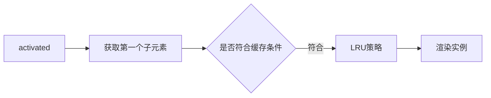

## watch和computed

### computed

1. computed 属性值默认会**缓存**计算结果，在重复的调用中，只要依赖数据不变，直接取缓存中的计算结果，只有**依赖型数据**发生**改变**，computed 才会重新计算；
2. computed 中的成员可以只定义一个函数作为只读属性, 也可以定义成 get/set 变成可读写属性, 但是 methods 中的成员没有这样的。

### watch

1. 可以看作是 computed 和 methods 的结合体；
2. 支持**异步**
3. **不支持缓存**
4. 可以监听**data，props，computed**内的数据；

## keep-alive

> 用处：由列表页面进入数据详情页面，再返回该列表页面，我们希望：列表页面可以保留用户的筛选（或选中）状态。总的来说，keep-alive 用于保存组件的渲染状态。
> keep-alive 缓存机制便是根据 LRU 策略来设置缓存组件新鲜度，将很久未访问的组件从缓存中删除。

作用：

1. 组件切换过程中将状态保留在内存中，防止重复渲染 DOM。
2. 避免反复渲染影响页面性能，减少接口请求
3. 进行路由缓存和组件缓存

### 为什么 keep-alive 标签不会生成真正 Dom 节点

1.  abstract 属性（抽象节点），根据这个属性跳过生成该实例

### 使用 LRU 机制

### Activated

> keep-alive 的模式下多了 activated 这个生命周期函数, keep-alive 的声明周期执行:

- 页面第一次进入

  - created-> mounted-> activated，当再次进入（前进或者后退）时，只触发 activated。

- 事件挂载的方法等，只执行一次的放在 mounted 中；组件每次进去执行的方法放在 activated 中。




### 基于keep-alive实现的缓存策略
**方案一**：整个页面缓存
```js
<keep-alive>
    <router-view v-if="$route.meta.keepAlive" />
</keep-alive>
<router-view v-if="!$route.meta.keepAlive" />
```

**方案二**：动态组件缓存
```js
<keep-alive :include="$store.state.keepAlive.cachedView">
    <cacheView></cacheView>
</keep-alive>
```