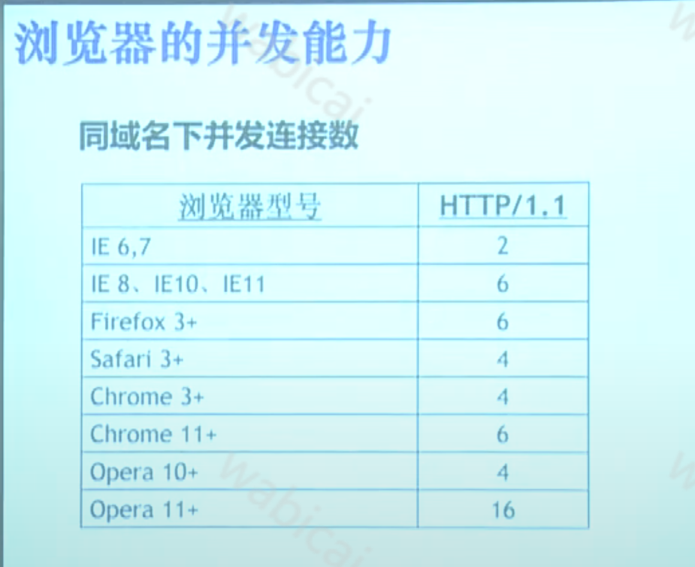

## 网页打开标准
1. 最满意要在【2秒】内打开
2. 要缩短在【八秒】内打开

# 提速方案

## 压缩
1. 文本文件压缩
   1. CSSS/HTML/JS空格、注释、换行等基于冗余的压缩
   2. JS的Minify（混淆）
2. Web端压缩
   1. 使用Gzip、Compress对下行Response内容的压缩
   2. 但会对Web端性能有一定影响。
   3. 不用在图片上面，因为图片一般都已经压缩过了。
   4. 需要HTTP协议进行支持
      1. 请求头：Accept-Encoding：compress，gzip。返回头：Content-Encoding。
 
## 缓存
1. 浏览器本地缓存
2. 反向代理服务器缓存
    1. 缓存服务器将多个相同请求，直接返回。
    2. 需要HTTP协议进行支持
       1. Expires：HTTP1.0规范
       2. Cache-control：HTTP1.1规范
       3. If-Modified-Since/Last-Modeified(时间戳可能不匹配)
          1. 分布式服务
          2. 精度只到秒级
       4. ETag/If-Node-Match
3. 如何使缓存失效？
    1. 改变请求URL

## 并发

原因：
1. 对操作系统端口资源考虑
PC总端口数为65536，那么一个TCP（http也是tcp）链接就占用一个端口。操作系统通常会对总端口一半开放对外请求，以防端口数量不被迅速消耗殆尽。

2. 过多并发导致频繁切换产生性能问题
3. 避免同一客服端并发大量请求超过服务端的并发阈值
在服务端通常都对同一个客户端来源设置并发阀值避免恶意攻击，如果浏览器不对同一域名做并发限制可能会导致超过服务端的并发阀值被BAN掉。
4. 客户端良知机制
为了防止两个应用抢占资源时候导致强势一方无限制的获取资源导致弱势一方永远阻塞状态。
### 优化手段
1. 域名散发：不要超过4个域名
2. 雪碧图
3. Cache-Control
4. 懒加载
5. PWA

## 动静分离
> 分不同域名存放
1. 服务器资源占用问题
2. Cookie

## Cookie
1. 设置Cookie方式
   1. Request包携带Cookie
   2. Response设置Cookie

## 雅虎34条军规
### 1. 减少HTTP请求次数
1. Cache
   1. 本地缓存、反向缓存
   2. 尽量缓存Ajax
2. 合并文件
   1. Image map
   2. CSS Sprite
   3. 合并JS、CSS
### 2. 内容优化
1. 避免跳转。（HTTP Request头信息）
2. 用域名划分页面内容
   1. 动静分离
   2. 不同域名下的文件可以并行加载
3. 减少DNS查找时间
   1. 减少域名数量
   2. 浏览器缓存、host缓存
   3. 与第二点有点矛盾。
4. 减少DOM元素
5. 避免404，减少304
   1. 404占用流量，又影响体验
6. 推迟加载/提前加载
### 3. 服务器优化
1. CDN
2. Expires或Cache-control
3. Gzip压缩
### 4. CSS和JavaScript
1. CSS
   1. 把CSS文件置于顶部。（避免DOM树解析完还要重新渲染。因为CSS边解析边渲染)
   2. 使用外部CSS 
      1. 可以缓存
      2. 可以动态加载
   3. 避免使用CSS表达式
   4. 使用link 代替@import。（import有一定随机性）
2. JavaScript
   1. Javascript置于底部。（不会并行加载其他资源，有可能会堵塞)
   2. 使用外部JS

## 请求的六个阶段
1. Blocked：查找缓存、等待网络
2. DNS Lookup：域名解析
   1. 时间片长: DNS服务器配置问题、DNS网络问题。不然只能找运营商了
3. Connection：连接服务器。（TCP）
   1. 路由可能有问题
   2. 连接之后的话，有可能是堵塞了。
4. Send：发送HTTP
5. Wait：等待回包
6. Receive：接受HTTP包
## 一：请求的数据响应时间时长时短，原因？处理方式？

## 二：首屏加载的优化有哪些？
比如进入的时候，白屏时间非常长，打开调试工具发现network有很多图片，还有JS文件非常大怎么解决？

## 三：秒杀系统前端和后端优化？

## 四：浏览器页面空白的原因有哪些?

　1). 可能在head 标签里放置了大量的 script 标签，导致浏览器必须等到全部javascript代码都被下载、解析、执行完成以后，才能开始呈现页面的内容

　　2). 可能是后端出现问题，并且禁用了错误输出。比如apache2，后端配置无错误输出，并且服务状态500，这个时候页面就是一片空白

